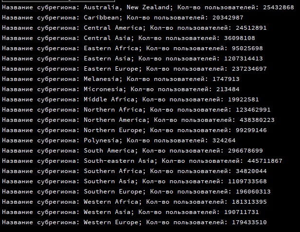
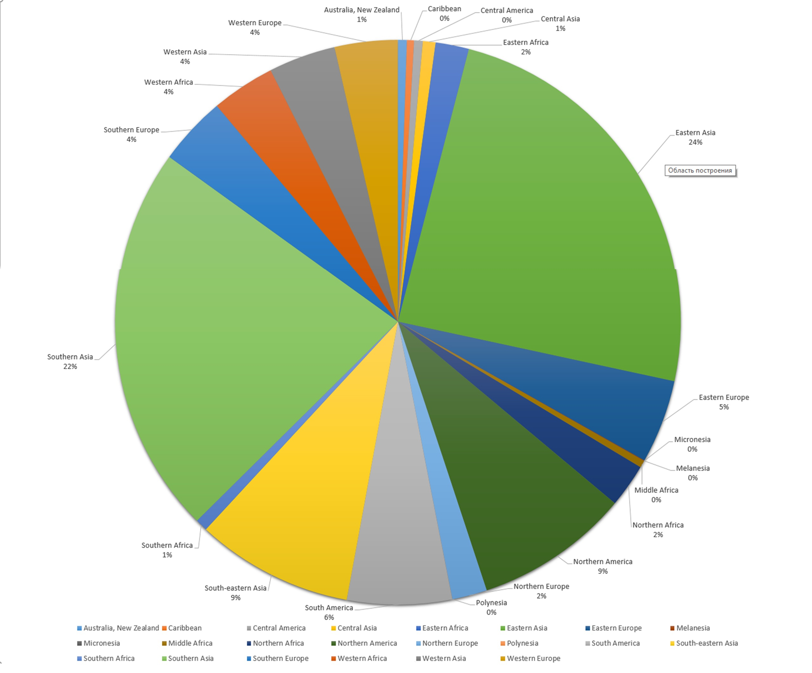
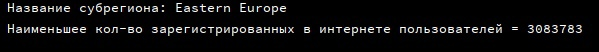
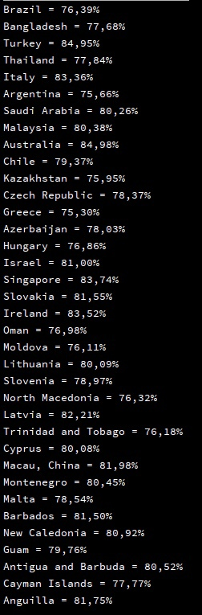
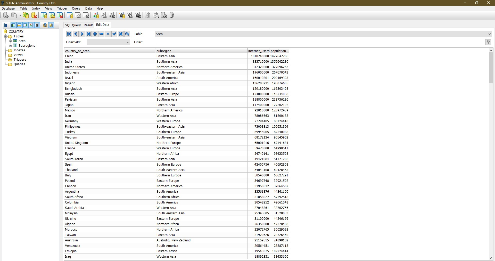
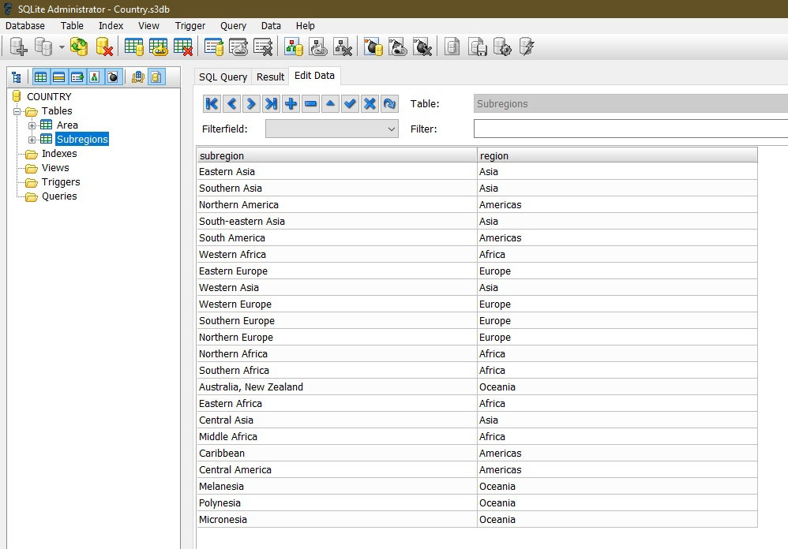

# Java
1. Создаём Java-проект
2. Разрабатываем класс для обработки CSV-файла
3. Скачиваем csv-файл
4. Создаём 2 класса для набора объектов, где будут храниться все данные с csv-файла
5. Запускаем программу, чтобы посмотреть как работает программа
6. Создаём БД, а также таблицы в самой БД
7. Разрабатываем класс для подключения бд, заполнения БД информацией из CSV-файла, а также отправления в БД запросов
8. Когда наша БД заполнена, приступаем к выполнению заданий
9. Разрабатываем методы для каждого задания, где методы будут отправлять запрос, его обрабатывать и выводить ответ в консоль
10. Для первого задания строим график по данным выведенных из метода для первого задания
11. Создаём репозиторий на нашей аккаунте GitHub
12. При помощи GitHub Desktop пушим все файлы в наш репозиторий
13. Пишем READ.ME файл на GitHub'е

<h1> Задание 1 </h1>

<h1> Задание 2 </h1>

<h1> Задание 3 </h1>

<h1> База данных </h1>

